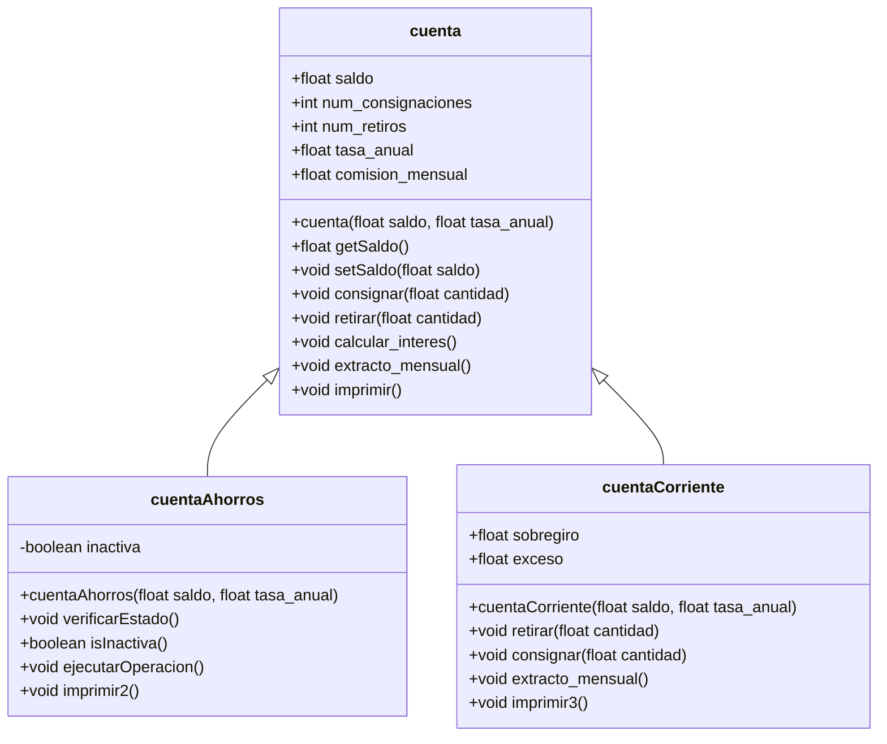

# Sistema de Cuentas Bancarias

Este proyecto implementa un sistema de cuentas bancarias en Java utilizando herencia. Incluye una clase base `cuenta` y dos subclases: `cuentaAhorros` y `cuentaCorriente`.

## Diagrama de Clases



## Descripción de Clases

### cuenta
Clase base que representa una cuenta bancaria genérica.
- **Atributos**: saldo, num_consignaciones, num_retiros, tasa_anual, comision_mensual
- **Métodos principales**:
  - `consignar(float cantidad)`: Agrega dinero al saldo si la cantidad es positiva
  - `retirar(float cantidad)`: Resta dinero del saldo si hay suficiente
  - `calcular_interes()`: Calcula el interés mensual basado en la tasa anual
  - `extracto_mensual()`: Aplica la comisión mensual y calcula intereses
  - `imprimir()`: Muestra los valores de los atributos

### cuentaAhorros
Subclase de `cuenta` que representa una cuenta de ahorros con restricciones.
- **Atributo adicional**: `inactiva` (booleano) - indica si la cuenta está inactiva
- **Lógica**: La cuenta está inactiva si el saldo es menor a 10000
- **Métodos principales**:
  - `verificarEstado()`: Actualiza el estado de inactividad
  - `isInactiva()`: Retorna si la cuenta está inactiva
  - `ejecutarOperacion()`: Realiza operaciones solo si la cuenta no está inactiva
  - `imprimir2()`: Imprime información específica de la cuenta de ahorros

### cuentaCorriente
Subclase de `cuenta` que representa una cuenta corriente con sobregiro.
- **Atributos adicionales**: `sobregiro`, `exceso`
- **Lógica**: Permite retiros que excedan el saldo, generando sobregiro
- **Métodos sobrescritos**:
  - `retirar(float cantidad)`: Maneja retiros con sobregiro
  - `consignar(float cantidad)`: Reduce el sobregiro primero antes de aumentar el saldo
  - `imprimir3()`: Imprime información específica de la cuenta corriente

### Main
Clase principal que demuestra el funcionamiento del sistema creando instancias de cada tipo de cuenta y ejecutando operaciones.

## Cómo Ejecutar

### Requisitos
- Java JDK 8 o superior
- Maven (opcional, para gestión de dependencias)

### Compilación y Ejecución
1. Navega al directorio raíz del proyecto
2. Compila el proyecto:
   ```
   mvn compile
   ```
3. Ejecuta la clase principal:
   ```
   mvn exec:java -Dexec.mainClass="com.herencia.Main"
   ```

O directamente con Java:
```
javac -cp src/main/java src/main/java/com/herencia/*.java
java -cp src/main/java com.herencia.Main
```

## Estructura del Proyecto
```
cuenta_bancaria/
├── pom.xml
├── README.md
└── src/
    ├── main/
    │   └── java/
    │       └── com/
    │           └── herencia/
    │               ├── cuenta.java
    │               ├── cuentaAhorros.java
    │               ├── cuentaCorriente.java
    │               └── Main.java
    └── test/
        └── java/
```